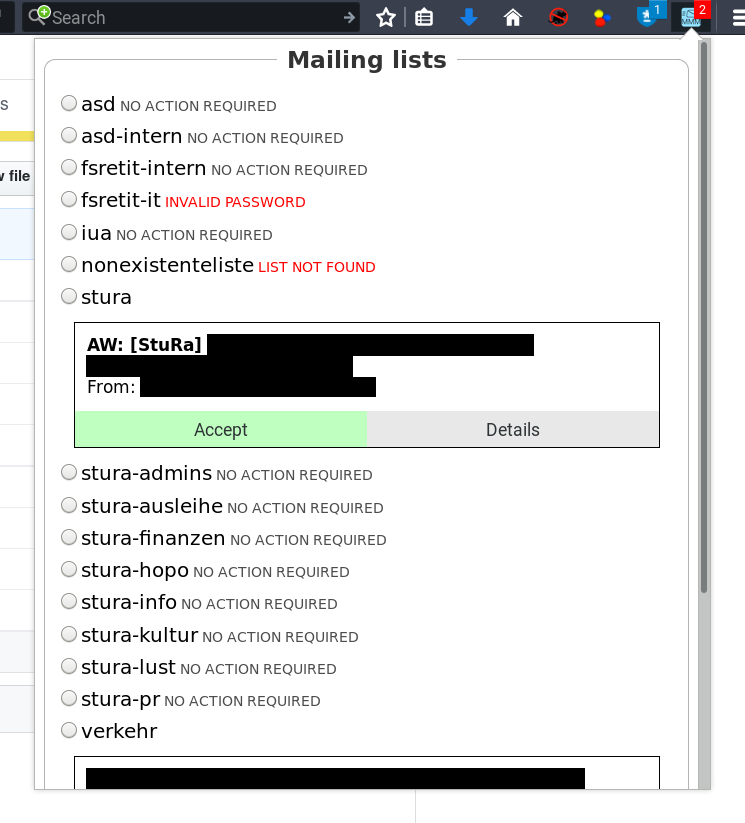

# Mailman Moderation (WebExtension)
Manage and moderate all your mailman lists in one place

## WARNING
This extension was created and tested only with one server (GNU Mailman v2.1.23, german language)
and may not work on your server correctly. Please test the functionality with a test e-mail
before using this add-on in production to prevent data loss.

Mailman v3 uses a new web system and api and will most certainly not work. If you can provide me
with a test installation, i'll try my best to update this extension for it.

## Features
- Stores your credentials (optionally in your browser's cloud) so you do not have to enter them everywhere again
- Show pending messages and join requests in all your mailing lists
- Display individual mail headers and content
- Accept, Reject and Discard e-mails
- Automatic background checks

## Limitations
- Mailman v2 only

## Manual Installation
Note that you may have to repeat these steps each time you restart your browser. However, your browser should keep your storage across versions (only tested with FF). Export your settings regularly :)

### Firefox (current / ESR 52)
- Clone this repository
- In Firefox, enter the URL `about:debugging`
- Click 'Load temporary add-on' and select the file 'manifest.json' in this directory

### Chromium / Google Chrome
- Clone this repository
- Open the Chrome menu and go to 'More Tools > Extensions'
- Enable Developer Mode and click 'Load unpacked extension'
- Select the folder you cloned this repository to

## Example screenshot

## License, attributions
This extension is licensed under the [GNU Affero General Public License](agpl-3.0.txt), version 3 or above

The new icon shamelessly uses the original [GNU Mailman logo](https://www.gnu.org/software/mailman/images/logo2010.svg) by Andrija Arsic and glyphs from [Font Awesome](http://fontawesome.io) by Dave Gandy.
